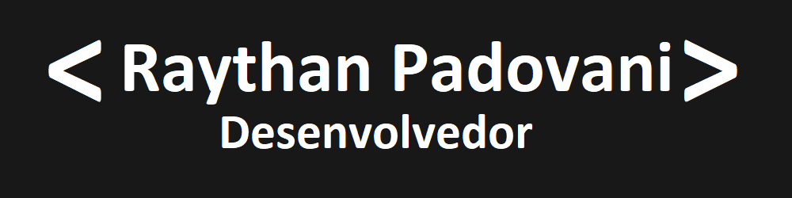

  

   
   
   
   
   
   
   
   
   
   
   
   
   
   
   
   
   
   

<h4 align="center">

Mais...

<h1 align="center">Oi meu nome é Raythan Padovani</h1></img>

  
  

  
</a>

<h3 align="center">Sobre mim:</h3>

  <a target="_blank" href="https://www.linkedin.com/in/raythan-padovani-8723a3a8/">
    

